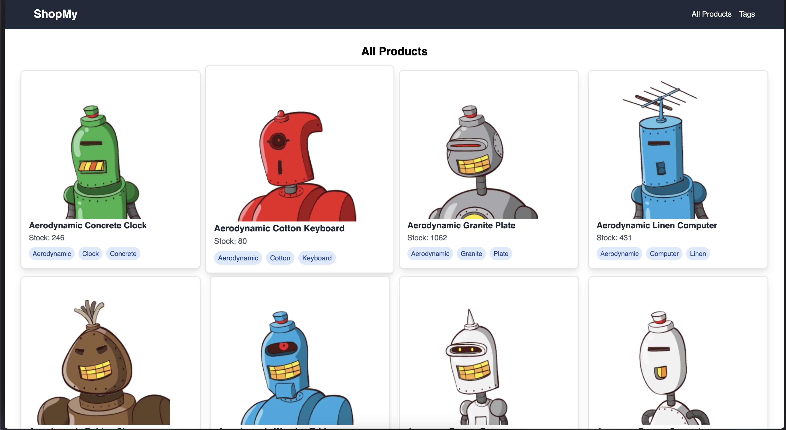
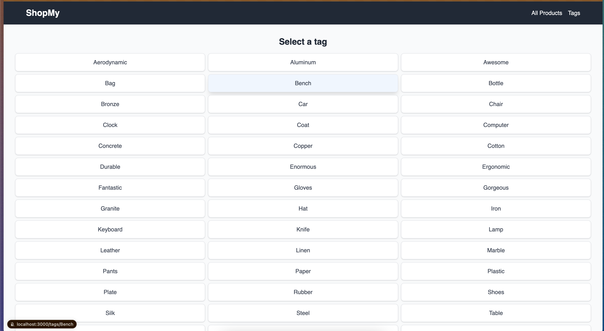
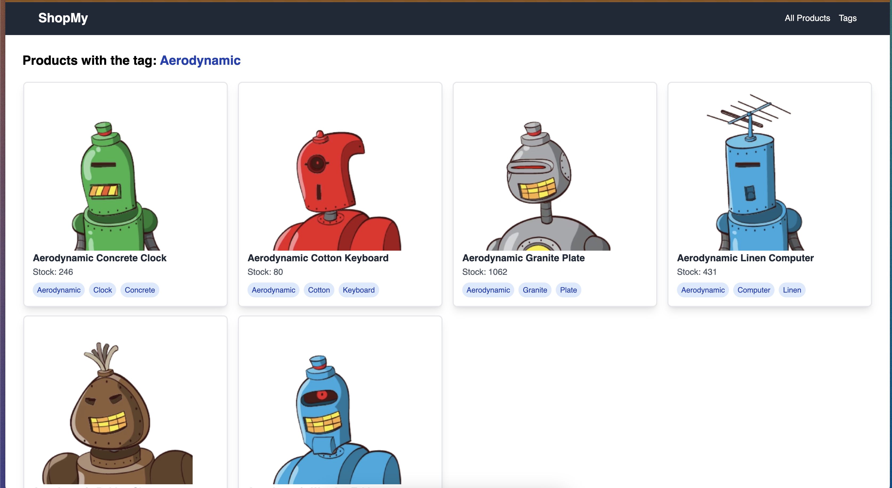

# Shopify App

A Shopify application that fetches product data from the Shopify API, allowing filtering by name, stock, and tags. Developed as part of an internship interview challenge.

## Installation

To set up the project locally, follow these steps:

1. **Clone the repository:**

   ```bash
   git clone https://github.com/G00li/shopify.git
   cd shopify
   ````
2. **Install dependencies:**

    ```bash
    npm install
    ```
3. **Start the development server:**
    ```bash
    npm run dev
    ````

The application will be available at http://localhost:3000.

## Screenshots





## Project Structure
The project is organized as follows:

````
shopify/
├── components/
├── lib/
│   └── api/
├── pages/
├── public/
├── styles/
├── .gitignore
├── README.md
├── next.config.ts
├── package-lock.json
├── package.json
├── postcss.config.js
├── tailwind.config.js
└── tsconfig.json
````

## Technologies Used

- **Next.js**: A React framework for server-side rendering and static site generation.
- **TypeScript**: A statically typed programming language that builds on JavaScript.
- **Tailwind CSS**: A utility-first CSS framework for styling.
- **PostCSS**: A tool for transforming CSS with JavaScript plugins.

## License
This project is licensed under the MIT License.

